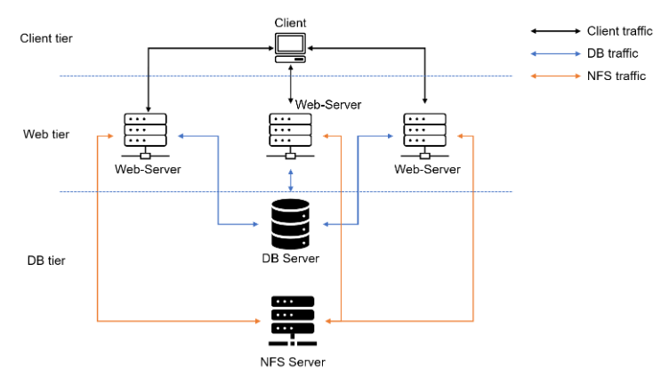

# IMPLEMENTING A WEB SOLUTION FOR A DEVOPS TEAM USING LAMP STACK WITH REMOTE DATABASE AND NFS SERVER
DevOps Project

This project uses a set of DevOps tools that will help the team in their day-to-day activities of managing, developing, testing, deploying, and monitoring different projects.

### A single DevOps tooling Solution that will be used in this solution include:

- Jenkins:  free and open source automation server used to build CI/CD pipelines.
- Kubernetes:  an open-source container-orchestration system for automating computer application deployment, scaling, and management.
- Jfrog Artifactory:  Universal Repository Manager supporting all major packaging formats, build tools, and CI servers. Artifactory.
- Rancher:  an open source software platform that enables organisations to run and manage Docker and Kubernetes in production.
- Grafana:  a multi-platform open source analytics and interactive visualisation web application.
- Prometheus:  An open-source monitoring system with a dimensional data model, flexible query language, efficient time series database, and modern alerting approach.
- Kibana:  Kibana is a free and open user interface that lets you visualise your Elasticsearch data and navigate the Elastic Stack.


### The solution consist of the following components: 
- Infrastructure: AWS
- 3 x Webserver Linux: Red Hat Enterprise Linux 8
- Database Server: Ubuntu 20.04 + MySQL
- Storage Server: Red Hat Enterprise Linux 8 + NFS Server
- Programming Language: PHP
- Code Repository: GitHub

### 3-tier Web Application Architecture with a single Database and an NFS Server



In the diagram above, there is a common pattern where several stateless Web servers share a common database and also access the same files using the Network File System (NFS) as shared file storage. Even though the NFS server might be located on completely separate hardware, for web servers, it looks like a local file system from which they can serve the same files.

created 3 Redhat Linux servers and 1 ubuntu server named
- web-server1.
- web-server2.
- web-server3.
- NFS.


create 3 volumes from Elastic block stores in the same availability zone as the NFS server and attach the 3 volumes to the NFS server

use command **lsblk** to list block devices on NFS
```
lsblk
```


use command **sudo gdisk** to creat partition on the attached device i.e /dev/xvdf,dev/xvdg and /dev/xvdh
```
sudo gdisk
```


use command **lsblk** to list block devices
```
lsblk
```


installing lvm2 wih 
```
sudo yum install lvm2 -y
```
use command **sudo lvmdiskscan** to check for lvm partition
```
sudo lvmdiskscan
```
creating physical volumes with pvcreate on the partition
```
sudo pvcreate /dev/xvdf1
```
```
sudo pvcreate /dev/xvdg1
```
```
sudo pvcreate /dev/xvdh1
```


check for the physical volume
```
sudo pvs 
```


create volume group "webdata" with and add the physical volume to the group
```
 sudo vgcreate webdata-vg /dev/xvdh1 /dev/xvdg1 /dev/xvdf1
 ```
 check the group with 
 ```
 sudo vgs
 ```
 

 creating Logical volumes

- lv-apps
- lv-logs
- lv-opt

Each with 9G memeory and added the to the webdata-vg group
```
sudo lvcreate -n lv-apps -L 9G webata-vg
```


formating the 3 logical volumes as xfs
```
sudo mkfs -t xfs /dev/webdata-vg/lv-apps
```
```
sudo mkfs -t xfs /dev/webdata-vg/lv-log
```
```
sudo mkfs -t xfs /dev/webdata-vg/lv-opt
```


Creating mount points on /mnt directory for the logical volumes

Mount lv-apps on /mnt/apps – To be used by webservers
Mount lv-logs on /mnt/logs – To be used by webserver logs
Mount lv-opt on /mnt/opt – To be used by Jenkins server
```
sudo mkdir /mnt/apps
```
```
sudo mkdir /mnt/logs
```
```
sudo mkdir /mnt/opt
```
```
sudo mount /dev/webdata-vg/lv-apps /mnt/apps
```
```
sudo mount /dev/webdata-vg/lv-apps /mnt/logs
```
```
sudo mount /dev/webdata-vg/lv-apps /mnt/opt
```

Install NFS server, configure it to start on reboot and make sure it is rumming
```
sudo yum -y update
```

### configure the Database while updating NFS Server

install msql server 
```
sudo apt install mysql-server
```

Create a database and name it tooling
```
sudo mysql
```
```
create database tooling;
```
Create a database user and name it webaccess, grant permission only from the webservers subnet id(webserver 1)
```
create user 'webaccess'@'172.31.32.0/20' identified by 'password'
```
Grant all privileges
```
grant all privileges on tooling.\* to 'webaccess'@'172.31.32.0/20';
```
flush privileges
```
flush privileges;
```


### Install NFS server, configure it to start on reboot and make sure it is rumming
```
sudo yum -y update
```
```
sudo yum install nfs-utils -y
```
```
sudo systemctl start nfs-server.service
```
```
sudo systemctl enable nfs-server.service
```
```
sudo systemctl status nfs-server.service
```


set permission that allows web server to read, write and exexcute files on NFS
```
sudo chown -R nobody: /mnt/apps
```
```
sudo chown -R nobody: /mnt/logs
```
```
sudo chown -R nobody: /mnt/opt
```
```
sudo chmod -R 777 /mnt/apps
```
```
sudo chmod -R 777 /mnt/logs
```
```
sudo chmod -R 777 /mnt/opt
```
```
sudo systemctl restart nfs-server.service
```

Configure access to NFS for clients within the same subnet using(webserver 1: 172.31.32.0/20)
```
sudo vi /etc/exports
```
```
mnt/apps <Subnet-CIDR>(rw,sync,no_all_squash,no_root_squash)
```
```
mnt/logs <Subnet-CIDR>(rw,sync,no_all_squash,no_root_squash)
```
```
mnt/opt <Subnet-CIDR>(rw,sync,no_all_squash,no_root_squash)
```
save with: esc:wq! 

Export all the subnet access configuration so the webserver can see all the mount points when we want to connect with this command
```
sudo exportfs -arv
```


Check which port is used by NFS and open it using Security Groups (add new Inbound Rule)
```
rpcinfo -p | grep nfs
```


Important note: In order for NFS server to be accessible from your client, you must also open following ports: TCP 111, UDP 111, UDP 2049


### Prepare the webservers (webserver)

Install NFS client on (webserver 1)
```
sudo yum install nfs-utils nfs4-acl-tools -y
```
Mount /var/www/ and target the NFS server’s export for apps
```
sudo mkdir /var/www
```
```
sudo mount -t nfs -o rw,nosuid <NFS-Server-Private-IP-Address>:/mnt/apps /var/www
```


Verify that NFS was mounted successfully by running df -h. Make sure that the changes will persist on Web Server after reboot
```
df -h
```
```
sudo vi /etc/fstab
```
add following line

**<NFS-Server-Private-IP-Address>:/mnt/apps /var/www nfs defaults 0 0**

Install Remi’s repository, Apache and PHP on webservers (webserver 1)
```
sudo yum install httpd -y
```
```
sudo dnf install https://dl.fedoraproject.org/pub/epel/epel-release-latest-8.noarch.rpm
```
```
sudo dnf install dnf-utils http://rpms.remirepo.net/enterprise/remi-release-8.rpm
```
```
sudo dnf module reset php
```
```
sudo dnf module enable php:remi-7.4
```
```
sudo dnf install php php-opcache php-gd php-curl php-mysqlnd
```
```
sudo systemctl start php-fpm
```
```
sudo systemctl enable php-fpm
```
```
setsebool -P httpd_execmem 1
```


Locate the log folder for Apache on the Web Server and mount it to NFS server’s export for logs. Repeat step №4 to make sure the mount point will persist after reboot.

sudo mount -t nfs -o rw,nosuid <NFS-Server-Private-IP-Address>:/mnt/logs /var/log/httpd

i.e sudo mount -t nfs -o rw,nosuid 172.31.46.236:/mnt/logs /var/log/httpd

Repeat step №4 to make sure the mount point will persist after reboot.

i.e sudo vi /etc/fstab

172.31.46.236:/mnt/logs /var/log/httpd nfs defaults 0 0


Fork the tooling source code from [Github Account](https://github.com/Olaminiyi/tooling.git) to your Github account

install git: sudo yum install git
```
git init
```
```
git clone https://github.com/Olaminiyi/tooling.git
```
```
ls
cd tooling
ls
```


Deploy the tooling website’s code to the Webserver. Ensure that the html folder from the repository is deployed to /var/www/html
```
sudo cp -R html/. /var/www/html
```


> [!NOTE] 
> Do not forget to open TCP port 80 on the Web Server.
  


check permissions to your /var/www/html folder and also disable SELinux sudo setenforce 0
To make this change permanent – open following config file 
```
sudo vi /etc/sysconfig/selinux 
```
and set SELINUX=disabled then restart httpd.

cd .. out from tooling
```
sudo setenforce 0
```
```
sudo vi /etc/sysconfig/selinux
```

set SELINUX=disabled

then
```
sudo systemctl start httpd
```
```
sudo systemctl status httpd
```


Update the website’s configuration to connect to the database
```
vi /var/www/html/functions.php
```
under connection to the database
edit `admin` (username) to `webaccess`
edit `admin` (password) to `password`
edit `mysql.tooling.svc.cluster.local` to (db private ip address)


in the the database security group
allow `mysql/aurora` rule on Database using the **Subnet-CIDR (from anywhere 0.0.0.0)** of the webserver 1


### Follow these steps on the database
```
vi /etc/mysql/mysql.conf.d/mysqld.cnf
```

change the bind address to 0.0.0.0
change the mysqlx-bind-address to 0.0.0.0
```
sudo systemctl restart mysql
```
```
sudo systemctl status mysql
```


### Follow these steps on the webserver 1

install mysql on the webser
```
cd tooling
```
```  
sudo yum install mysql
```

Apply tooling-db.sql script to your database using this command

mysql -h <databse-private-ip> -u <db-username> -p <database name> < tooling-db.sql


### Follow these steps on the database
```
sudo mysql;
```
```
show databases;
```
```
use tooling;
```
```
show tables;
```
```
select * from users;
```  


To change the landing page on the webserver follow these steps
```
cd tooling
```
```
vi /etc/httpd/conf.d/welcome.conf
```
Create a backup
```
sudo mv /etc/httpd/conf.d/welcome.conf /etc/httpd/conf.d/welcome.backup
```


Open the website in your browser **http://Web-Server-Public-IP-Address-or-Public-DNS-Name/index.php**


