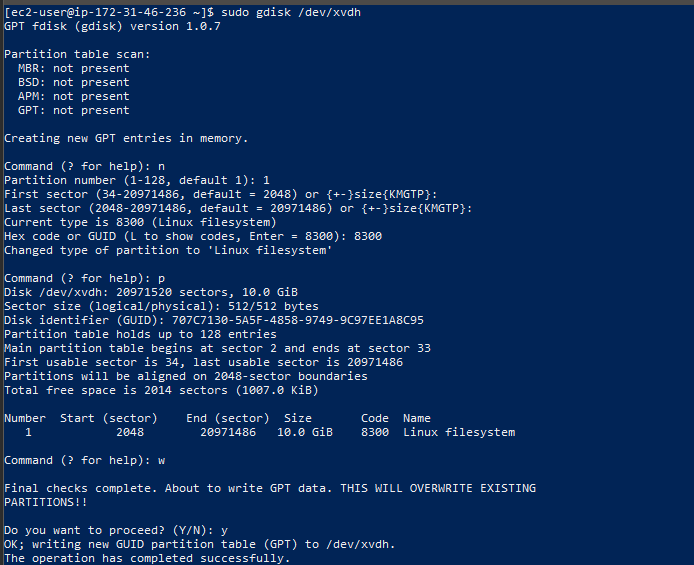
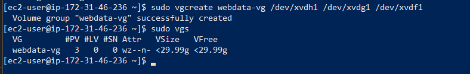
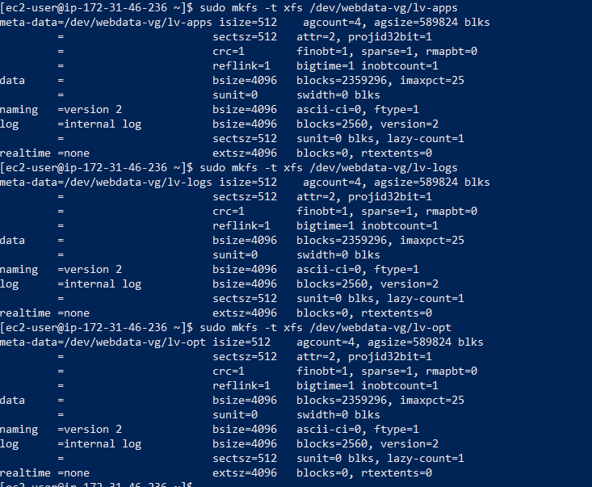

# IMPLEMENTING A WEB SOLUTION FOR A DEVOPS TEAM USING LAMP STACK WITH REMOTE DATABASE AND NFS SERVER
DevOps Project

This project uses a set of DevOps tools that will help the team in their day-to-day activities of managing, developing, testing, deploying, and monitoring different projects.

### A single DevOps tooling Solution that will be used in this solution include:

- Jenkins:  free and open source automation server used to build CI/CD pipelines.
- Kubernetes:  an open-source container-orchestration system for automating computer application deployment, scaling, and management.
- Jfrog Artifactory:  Universal Repository Manager supporting all major packaging formats, build tools, and CI servers. Artifactory.
- Rancher:  an open source software platform that enables organisations to run and manage Docker and Kubernetes in production.
- Grafana:  a multi-platform open source analytics and interactive visualisation web application.
- Prometheus:  An open-source monitoring system with a dimensional data model, flexible query language, efficient time series database, and modern alerting approach.
- Kibana:  Kibana is a free and open user interface that lets you visualise your Elasticsearch data and navigate the Elastic Stack.


### The solution consist of the following components: 
- Infrastructure: AWS
- 3 x Webserver Linux: Red Hat Enterprise Linux 8
- Database Server: Ubuntu 20.04 + MySQL
- Storage Server: Red Hat Enterprise Linux 8 + NFS Server
- Programming Language: PHP
- Code Repository: GitHub

### 3-tier Web Application Architecture with a single Database and an NFS Server


In the diagram above, there is a common pattern where several stateless Web servers share a common database and also access the same files using the Network File System (NFS) as shared file storage. Even though the NFS server might be located on completely separate hardware, for web servers, it looks like a local file system from which they can serve the same files.

created 4 Redhat Linux servers and 1 ubuntu server named
- WEBSERVER 1
- WEBSERVER 2
- WEBSERVER 3
- NFS


create 3 volumes from Elastic block stores in the same availability zone as the NFS server and attach the 3 volumes to the NFS server

use command **lsblk** to list block devices on NFS
```
lsblk
```


use command **sudo gdisk** to creat partition on the attached device i.e /dev/xvdf,dev/xvdg and /dev/xvdh
```
sudo gdisk
```




use command **lsblk** to list block devices
```
lsblk
```


installing lvm2 wih 
```
sudo yum install lvm2 -y
```
use command **sudo lvmdiskscan** to check for lvm partition
```
sudo lvmdiskscan
```
creating physical volumes with pvcreate on the partition
```
sudo pvcreate /dev/xvdf1
```
```
sudo pvcreate /dev/xvdg1
```
```
sudo pvcreate /dev/xvdh1
```


check for the physical volume
```
sudo pvs 
```


create volume group "webdata" with and add the physical volume to the group
```
 sudo vgcreate webdata-vg /dev/xvdh1 /dev/xvdg1 /dev/xvdf1
 ```
 check the group with 
 ```
 sudo vgs
 ```
 

 creating Logical volumes

- lv-apps
- lv-logs
- lv-opt

Each with 9G memeory and added the to the webdata-vg group
```
sudo lvcreate -n lv-apps -L 9G webata-vg
```


formating the 3 logical volumes as xfs
```
sudo mkfs -t xfs /dev/webdata-vg/lv-apps
```
```
sudo mkfs -t xfs /dev/webdata-vg/lv-log
```
```
sudo mkfs -t xfs /dev/webdata-vg/lv-opt
```


Creating mount points on /mnt directory for the logical volumes

Mount lv-apps on /mnt/apps – To be used by webservers
Mount lv-logs on /mnt/logs – To be used by webserver logs
Mount lv-opt on /mnt/opt – To be used by Jenkins server
```
sudo mkdir /mnt/apps
```
```
sudo mkdir /mnt/logs
```
```
sudo mkdir /mnt/opt
```
```
sudo mount /dev/webdata-vg/lv-apps /mnt/apps
```
```
sudo mount /dev/webdata-vg/lv-apps /mnt/logs
```
```
sudo mount /dev/webdata-vg/lv-apps /mnt/opt
```

Install NFS server, configure it to start on reboot and make sure it is rumming
```
sudo yum -y update
```

configure the Database while updating NFS Server

install msql server 
```
sudo apt install mysql-server
```

Create a database and name it tooling
```
sudo mysql
```
```
create database tooling;
```
