1. created 4 Redhat Linux servers and 1 ubuntu server
2. Named the 4 Redhat servers

- WEBSERVER 1
- WEBSERVER 2
- WEBSERVER 3
- NFS

3. The ubuntu server is named as DB
   [Servers image]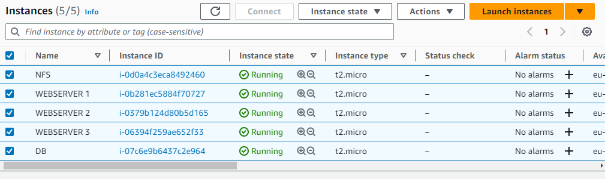

- command **lsbk** to list block devices
  on NFS 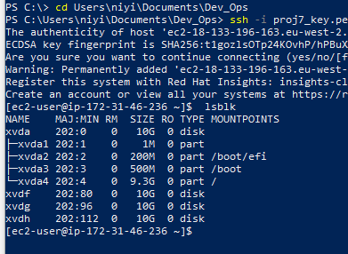

- command **sudo gdisk** to creat partition on

  - /dev/xvdf 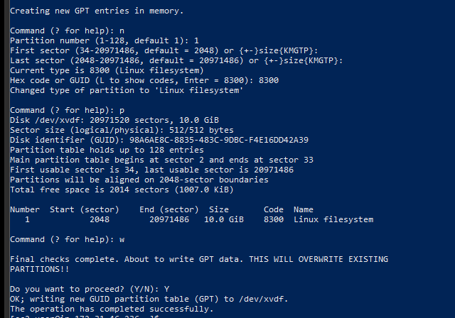
  - /dev/xvdg 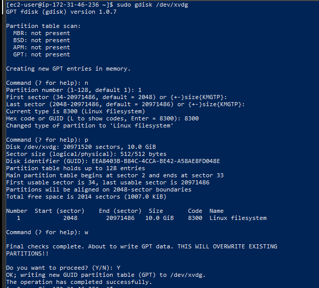
  - /dev/xvdh 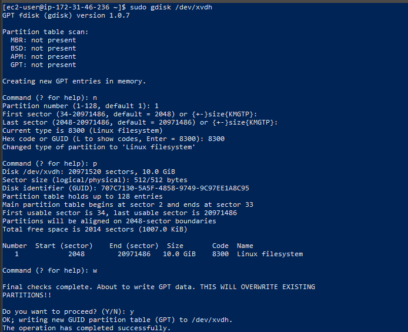

- command **lsbk** to list block devices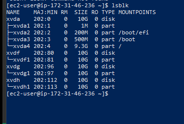

4. installing lvm2 wih **sudo yum install lvm2 -y**

- command **sudo lvmdiskscan** to check for lvm partition

5. creating physical volumes with on the partition

- **sudo pvcreate /dev/xvdf1**
- **sudo pvcreate /dev/xvdg1**
- **sudo pvcreate /dev/xvdh1**
  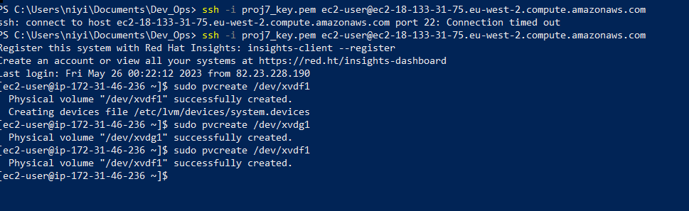

- sudo pvs to check for the physical volume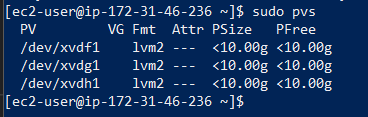

6. create volume group "webdata" with and add the physical volume to the group
   **sudo vgcreate webdata-vg /dev/xvdh1 /dev/xvdg1 /dev/xvdf1**

- check the group with sudo vgs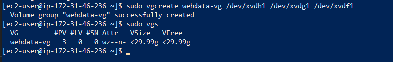

7. creating Logical volumes

- lv-apps
- lv-logs
- lv-opt
- Each with 9G memeory and added the to the webdata-vg gropu i.e ** sudo lvcreate -n lv-apps -L 9G webata-vg**
  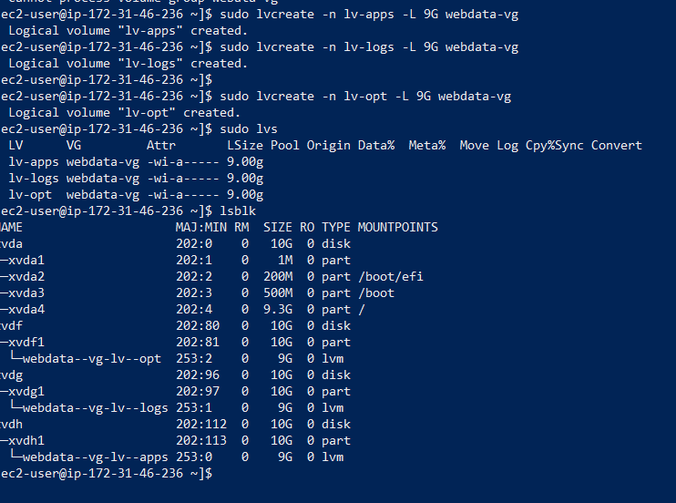

8. formating the 3 logical volumes as xfs

- **sudo mkfs -t xfs /dev/webdata-vg/lv-apps**
- **sudo mkfs -t xfs /dev/webdata-vg/lv-log**
- **sudo mkfs -t xfs /dev/webdata-vg/lv-opt**
  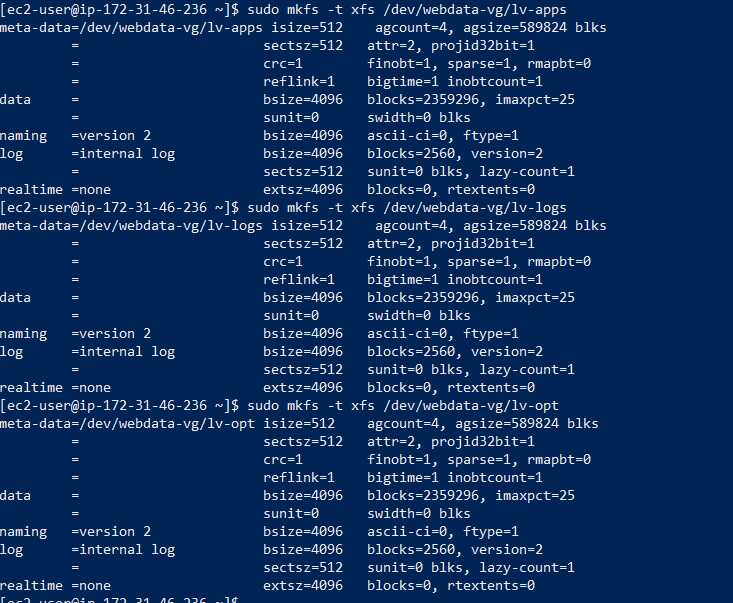

9. Creating mount points on /mnt directory for the logical volumes

- Mount lv-apps on /mnt/apps – To be used by webservers
- Mount lv-logs on /mnt/logs – To be used by webserver logs
- Mount lv-opt on /mnt/opt – To be used by Jenkins server
  - **sudo mkdir /mnt/apps**
  - **sudo mkdir /mnt/logs**
  - **sudo mkdir /mnt/opt**
    - **sudo mount /dev/webdata-vg/lv-apps /mnt/apps**
    - **sudo mount /dev/webdata-vg/lv-apps /mnt/logs**
    - **sudo mount /dev/webdata-vg/lv-apps /mnt/opt**
