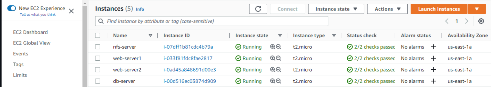

1. created 4 Redhat Linux servers and 1 ubuntu server
2. Named the 4 Redhat servers

- WEBSERVER 1
- WEBSERVER 2
- WEBSERVER 3
- NFS

3. The ubuntu server is named as DB

- create 3 volumes from Elastic block stores in the same availability zone as the NFS server
- attach the 3 volumes to the NFS server

- command **lsblk** to list block devices on NFS
  
   

- command **sudo gdisk** to creat partition on

  - /dev/xvdf 
  - /dev/xvdg 
  - /dev/xvdh 

- command **lsblk** to list block devices

4. installing lvm2 wih **sudo yum install lvm2 -y**

- command **sudo lvmdiskscan** to check for lvm partition

5. creating physical volumes with on the partition

- **sudo pvcreate /dev/xvdf1**
- **sudo pvcreate /dev/xvdg1**
- **sudo pvcreate /dev/xvdh1**
  

- sudo pvs to check for the physical volume

6. create volume group "webdata" with and add the physical volume to the group
   **sudo vgcreate webdata-vg /dev/xvdh1 /dev/xvdg1 /dev/xvdf1**

- check the group with sudo vgs

7. creating Logical volumes

- lv-apps
- lv-logs
- lv-opt
- Each with 9G memeory and added the to the webdata-vg gropu i.e ** sudo lvcreate -n lv-apps -L 9G webata-vg**
  

8. formating the 3 logical volumes as xfs

- **sudo mkfs -t xfs /dev/webdata-vg/lv-apps**
- **sudo mkfs -t xfs /dev/webdata-vg/lv-log**
- **sudo mkfs -t xfs /dev/webdata-vg/lv-opt**
  

9. Creating mount points on /mnt directory for the logical volumes

- Mount lv-apps on /mnt/apps – To be used by webservers
- Mount lv-logs on /mnt/logs – To be used by webserver logs
- Mount lv-opt on /mnt/opt – To be used by Jenkins server
  - **sudo mkdir /mnt/apps**
  - **sudo mkdir /mnt/logs**
  - **sudo mkdir /mnt/opt**
    - **sudo mount /dev/webdata-vg/lv-apps /mnt/apps**
    - **sudo mount /dev/webdata-vg/lv-apps /mnt/logs**
    - **sudo mount /dev/webdata-vg/lv-apps /mnt/opt**

10. Install NFS server, configure it to start on reboot and make sure it is rumming

- **sudo yum -y update**

11. configure the Database while updating NFS Server

- install msql server **sudo apt install mysql-server**

- Create a database and name it tooling

  - **sudo mysql**
  - **create database tooling;**

- Create a database user and name it webaccess, grant permission only from the webservers subnet id(webserver 1)

  - **create user 'webaccess'@'172.31.32.0/20' identified by 'password'**

- Grant all privileges
  - **grant all privileges on tooling.\* to 'webaccess'@'172.31.32.0/20';**
- flush privileges
  - **flush privileges;**
    

11. Install NFS server, configure it to start on reboot and make sure it is rumming

- **sudo yum -y update**
- **sudo yum install nfs-utils -y**
- **sudo systemctl start nfs-server.service**
- **sudo systemctl enable nfs-server.service**
- **sudo systemctl status nfs-server.service**

12. set permission that allows web server to read, write and exexcute files on NFS

- \*\*sudo chown -R nobody: /mnt/apps
- \*\*sudo chown -R nobody: /mnt/logs
- \*\*sudo chown -R nobody: /mnt/opt

- \*\*sudo chmod -R 777 /mnt/apps
- \*\*sudo chmod -R 777 /mnt/logs
- \*\*sudo chmod -R 777 /mnt/opt

- \*\*sudo systemctl restart nfs-server.service

13. Configure access to NFS for clients within the same subnet using(webserver 1: 172.31.32.0/20)

    - sudo vi /etc/exports
    - \*/mnt/apps <Subnet-CIDR>(rw,sync,no_all_squash,no_root_squash)
    - \*/mnt/logs <Subnet-CIDR>(rw,sync,no_all_squash,no_root_squash)
    - \*/mnt/opt <Subnet-CIDR>(rw,sync,no_all_squash,no_root_squash)

    (save: esc:wq! )

    - **sudo exportfs -arv** to export all the subnet access configuration so the webserver can see all the mount points when we want to connect.

14. Check which port is used by NFS and open it using Security Groups (add new Inbound Rule)

    - **rpcinfo -p | grep nfs**
      

15. Important note: In order for NFS server to be accessible from your client, you must also open following ports: TCP 111, UDP 111, UDP 2049
    
    

16. Prepare the webservers (webserver )

- Install NFS client on (webserver 1)
- **sudo yum install nfs-utils nfs4-acl-tools -y**

17. Mount /var/www/ and target the NFS server’s export for apps

- **sudo mkdir /var/www**
- **sudo mount -t nfs -o rw,nosuid <NFS-Server-Private-IP-Address>:/mnt/apps /var/www**
  

18. Verify that NFS was mounted successfully by running df -h. Make sure that the changes will persist on Web Server after reboot

- **sudo vi /etc/fstab**
  add following line
- **<NFS-Server-Private-IP-Address>:/mnt/apps /var/www nfs defaults 0 0**

19. Install Remi’s repository, Apache and PHP on webservers (webserver 1)

    - sudo yum install httpd -y

    - sudo dnf install https://dl.fedoraproject.org/pub/epel/epel-release-latest-8.noarch.rpm

    - sudo dnf install dnf-utils http://rpms.remirepo.net/enterprise/remi-release-8.rpm

    - sudo dnf module reset php

    - sudo dnf module enable php:remi-7.4

    - sudo dnf install php php-opcache php-gd php-curl php-mysqlnd

    - sudo systemctl start php-fpm

    - sudo systemctl enable php-fpm

    - setsebool -P httpd_execmem 1

20. Locate the log folder for Apache on the Web Server and mount it to NFS server’s export for logs. Repeat step №4 to make sure the mount point will persist after reboot.

    - **sudo mount -t nfs -o rw,nosuid <NFS-Server-Private-IP-Address>:/mnt/logs /var/log/httpd**
    - i.e sudo mount -t nfs -o rw,nosuid 172.31.46.236:/mnt/logs /var/log/httpd
    - Repeat step №4 to make sure the mount point will persist after reboot.
    - i.e sudo vi /etc/fstab
    - 172.31.46.236:/mnt/logs /var/log/httpd nfs defaults 0 0

21. Fork the tooling source code from Darey.io Github Account to your Github account

- install git: sudo yum install git
- git init
- git clone https://github.com/darey-io/tooling.git
- ls
- cd tooling
- ls
  

22. Deploy the tooling website’s code to the Webserver. Ensure that the html folder from the repository is deployed to /var/www/html

- sudo cp -R html/. /var/www/html
  

23. Note 1: Do not forget to open TCP port 80 on the Web Server.
    

24. check permissions to your /var/www/html folder and also disable SELinux sudo setenforce 0
    To make this change permanent – open following config file sudo vi /etc/sysconfig/selinux and set SELINUX=disabledthen restrt httpd.

- cd .. out from tooling
- **sudo setenforce 0**
- **sudo vi /etc/sysconfig/selinux**
- set SELINUX=disabledthen
- **sudo systemctl start httpd**
- **sudo systemctl status httpd**

27. Update the website’s configuration to connect to the database

- vi /var/www/html/functions.php
- under connection to the database
- edit admin (username) to webaccess
- edit admin (password) to password
- edit mysql.tooling.svc.cluster.local to (db private ip address)

- in the the database security group
  - allow mysql/aurora rule on Database using the Subnet-CIDR (from anywhere 0.0.0.0)of the webserver 1

28. on the database

- **vi /etc/mysql/mysql.conf.d/mysqld.cnf**
- change the bind address to 0.0.0.0
- change the mysqlx-bind-address to 0.0.0.0
- **sudo systemctl restart mysql**
- **sudo systemctl status mysql**

29. on the webserver 1

- install mysql on the webser
  - **cd tooling**
  - **sudo yum install mysql**
- Apply tooling-db.sql script to your database using this command
- mysql -h <databse-private-ip> -u <db-username> -p <database name> < tooling-db.sql

30. on the database

- **sudo mysql;**
- **show databases;**
- **use tooling;**
- **show tables;**
- **select * from users;**
  put picture

31. to change the landing page on the webserver

- cd tooling
- vi /etc/httpd/conf.d/welcome.conf
  create a backup
- sudo mv /etc/httpd/conf.d/welcome.conf /etc/httpd/conf.d/welcome.backup

32. Open the website in your browser http://<Web-Server-Public-IP-Address-or-Public-DNS-Name>/index.php 

